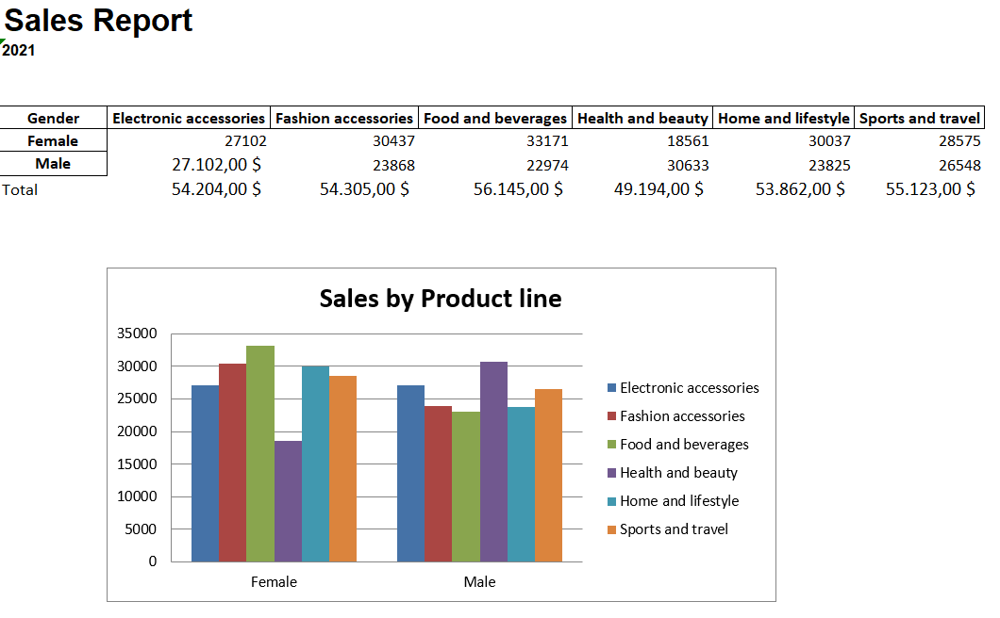

<h1 align="center">📄 Automating Excel Report 📄</h1>

Create a excel report (report_2021.xlsx) from a dataset of sales from a supermarket using python.
For the report I get from the dataset only the information that its necessary for me (Gender, Product Line, Total) and also creat a chart using these info.

  <a href="https://www.kaggle.com/datasets/aungpyaeap/supermarket-sales">Link to download Excel file with sales data</a>
  

Also added a title and removed the GridLines for a better presentation.

<h1 align="center">
  
</h1>

